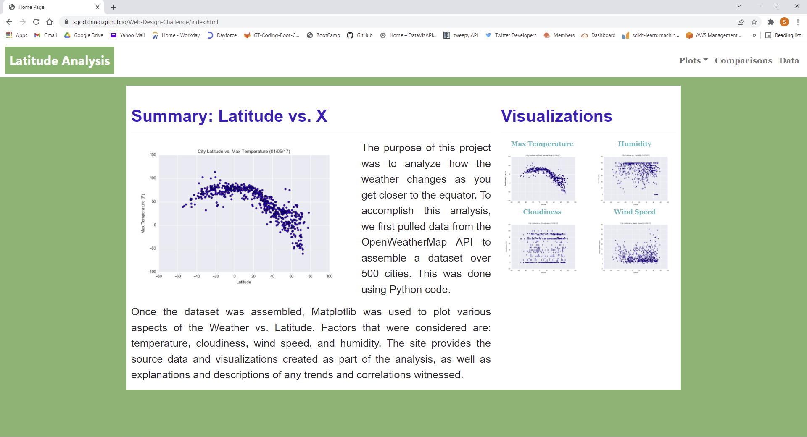
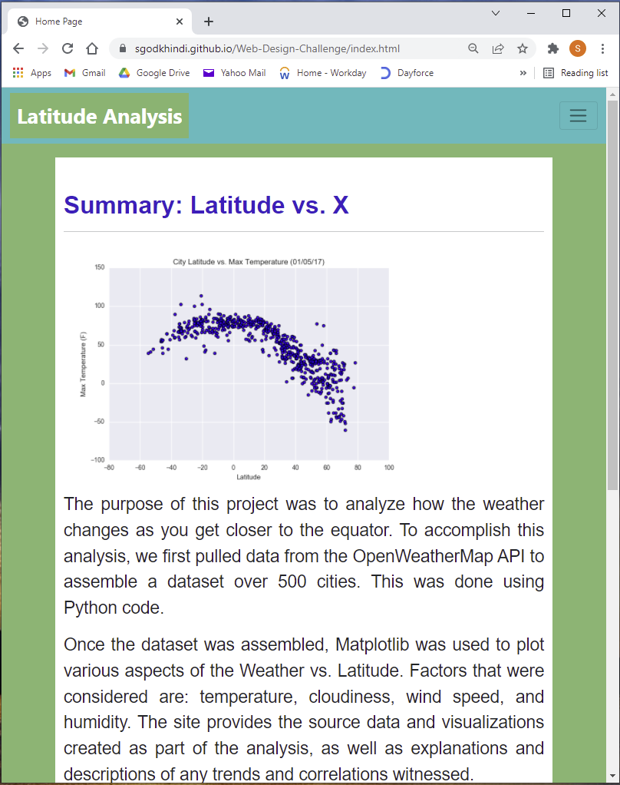
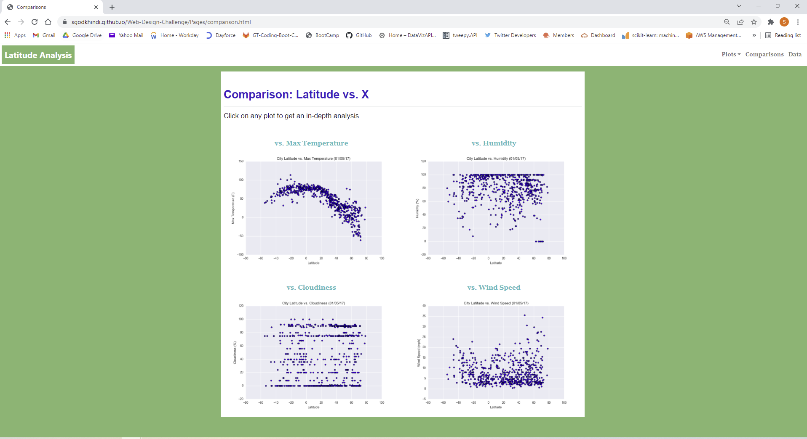
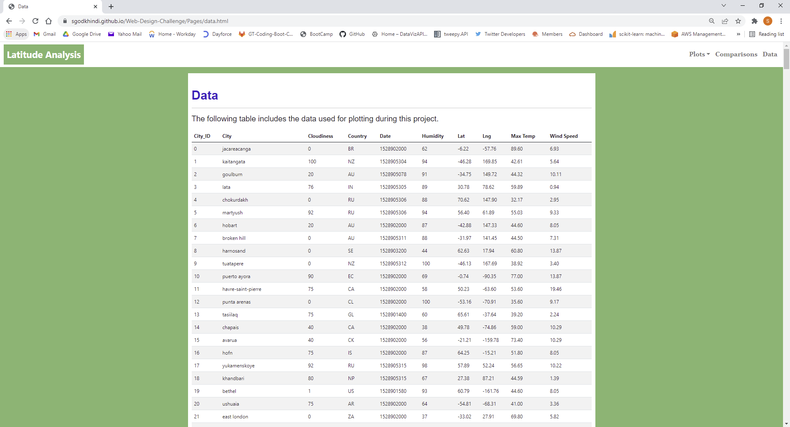
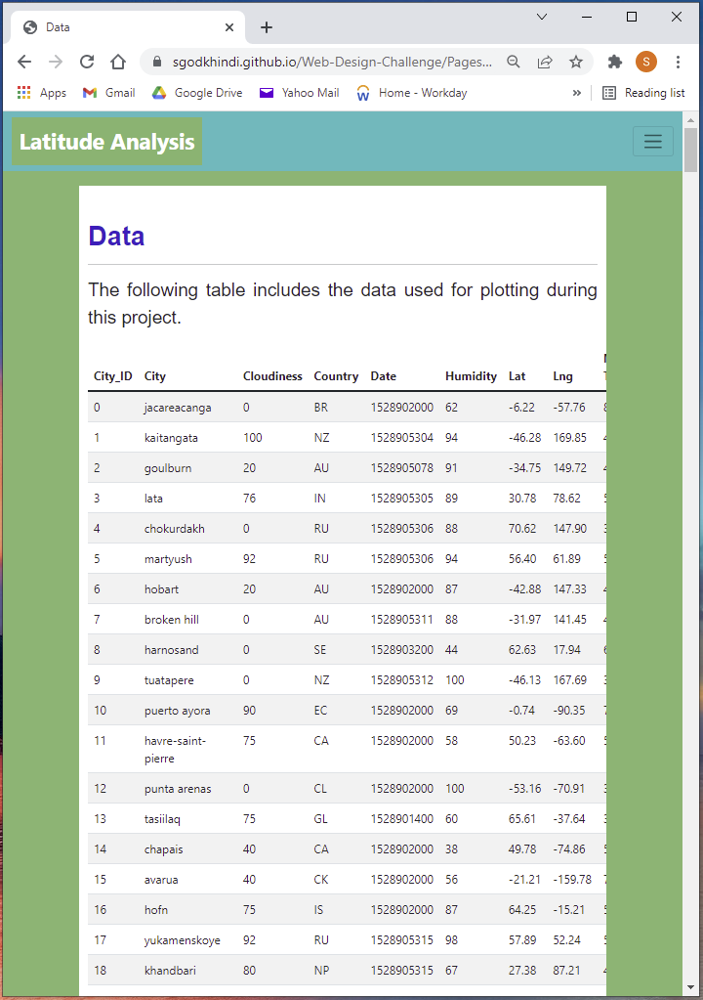
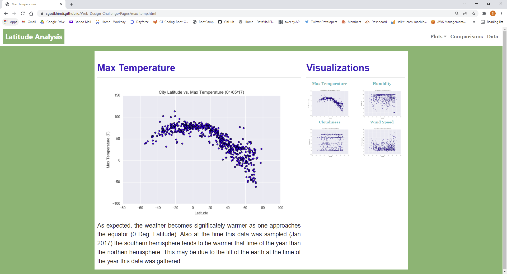
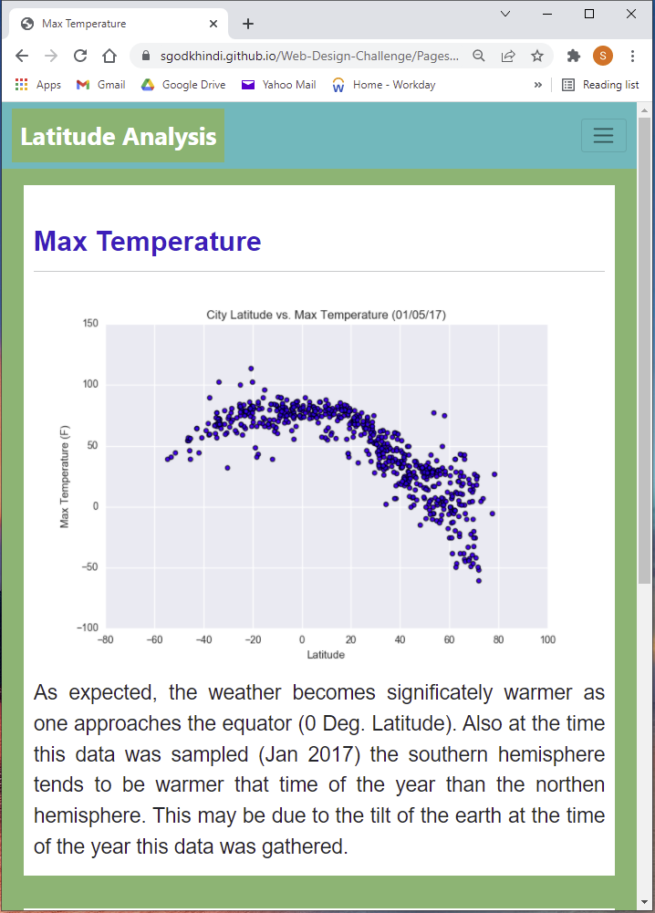
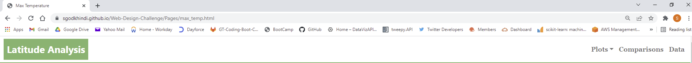
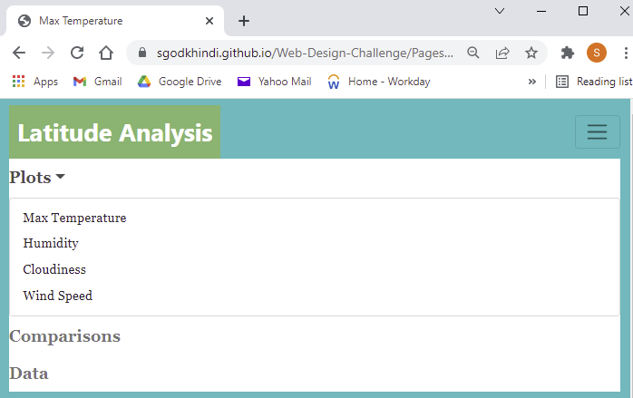

# Web-Design-Challenge

This repository contains my solution of the Web Design Challenge  - Web Visualization Dashboard (Latitude Analysis) for the GATECH Data Analytics &  Data Science Bootcamp.

### Launch Website
[Click here to access the website deployed using GitHub pages](https://sgodkhindi.github.io/Web-Design-Challenge/)

### Project Description
The requirements were to create a website that consists of 7 pages in total:

- A [landing page](#landing-page) containing:
* An explanation of the project.
* Links to each visualizations page with a sidebar containing preview images of each plot, and clicking an image should take the user to that visualization.

- There are 4 (Four) [visualization pages](#visualization-pages), each with:
* A descriptive title and heading tag.
* The plot/visualization itself for the selected comparison.
* A paragraph describing the plot and its significance.

- A ["Comparisons" page](#comparisons-page) that:
* Contains all of the visualizations on the same page so we can easily visually compare them. 
* This is using a Bootstrap grid for the visualization must be two visualizations across on screens medium and larger, and 1 across on extra-small and small screens.

- A ["Data" page](#data-page) that:
* Displays a responsive table containing the data used in the visualizations.
* The table must be a bootstrap table component.
* The data comes from exporting the cities.csv file as HTML using Pandas.

The website has a [navigation menu](#navigation-menu) at the top that:
* Has the name of the site on the left of the nav which allows users to return to the landing page from any page.
* Contains a dropdown menu on the right of the navbar named "Plots" that provides a link to each individual visualization page.
* Provides two more text links on the right: "Comparisons," which links to the comparisons page, and "Data," which links to the data page.

### Screenshots

This section contains screenshots of each page created:

#### Landing page

Large screen:

Small screen:

#### Comparisons page

Large screen:

Small screen:

#### Data page

Large screen:

Small screen:

#### Visualization pages

You'll build four of these, one for each visualization. Here's an example of one:

Large screen:

Small screen:

#### Navigation menu

Large screen:

Small screen:

